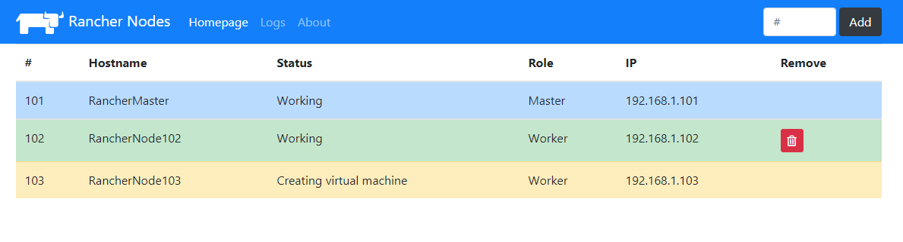

# Simply Add Rancher Nodes
A Web UI which to add rancher nodes on Proxmox via Bash scripts and Ansible.

## Features
- Add nodes on Rancher cluster
- Delete added nodes
- Read last logs that saved while adding or deleting
- Usable with REST APIs
- Able to run via Docker

## Requirements
- Proxmox Virtual Environment
- Running Rancher master node on proxmox (non RancherOS)
- A template of worker node with private SSH key and setted up IP on Proxmox. (SSH key must be OpenSSH format)
- Kubectl on master node
- Docker-compose on master node

## Installation
Installation is so easy with Docker-compose. Before up to docker compose you must do a few configuration. All steps should be installed to master node which Rancher cluster.
* Private key of worker node should be placed directory in `/docker/ranchernodes/config/` and file name should be `key`.
* Some configurations should be set on `envs` file in `/docker/ranchernodes/config/` directory.
* Run `docker-compose up`.
### Configration file environments
* `proxmoxuser`: Proxmox username.
* `proxmoxpass`: Proxmox user password.
* `proxmoxhost`: Proxmox hostname.
* `proxmoxnode`: Proxmox node that have Rancher cluster.
* `proxmoxstorage`: Storage that we want clone the template on Proxmox.
* `timeout`: Process timeout. (May up to three times.)
* `templateid`: Template ID of Rancher worker node that will be cloned.
* `vmsubnet`: Proxmox network Subnet IP address.
* `templateip`: IP address that worker node template necessary for some setups. (Must be an unused IP.)
* `masterip`: IP address of the master node.
* `nodecommand`: Docker command that will take from rancher for add new node.

Sample configuration should be as follows;

```
proxmoxuser=root@pam
proxmoxpass=123456
proxmoxhost=192.167.1.2
proxmoxnode=pve
proxmoxstorage=vms
timeout=180
templateid=201
vmsubnet=192.168.1.1
templateip=192.168.1.100
masterip=192.168.1.101
nodecommand="sudo docker run -d --privileged --restart=unless-stopped \
--net=host -v /etc/kubernetes:/etc/kubernetes -v /var/run:/var/run rancher/rancher-agent:v2.3.5 \
--server https://192.168.1.101:8443 --token rs576rlwrhmlhnzxp4zwh59ttpg67dnkrgx2wrgvtvxfln8k9ndfmg \
--ca-checksum 9f3c78ad3cf1d58b97c65b6a0a97a78bc7b8723f4108bfe4e1cdaf34e0d12609 --worker"
```

After `docker-compose up` command, the Web UI will be avaible at `<master-ip>:8080` The port is changeable from `docker-compose.yaml` file.


